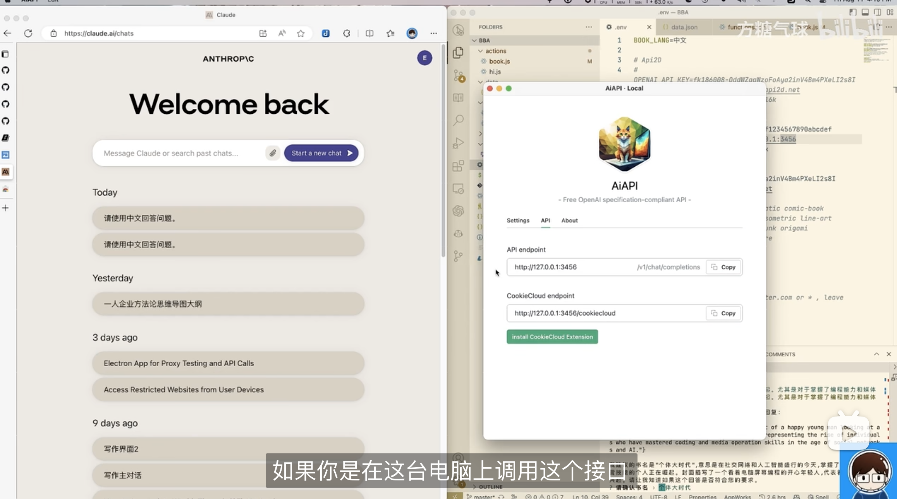

# Book By AI ( AKA B.B.A )

Generate high-quality books with AI

> 用AI生成高质量电子书

## 自动生成书籍DEMO

1. 人工输入文字：十个以内
1. 生成时间：累计2小时
1. 花费成本：3元左右（30张图片的生成费用）
1. 在线阅读：<https://demo01.level06.com/>

## 视频教程

[Youtube](https://www.youtube.com/watch?v=iMUg8ccIeZg) | [B站](https://www.bilibili.com/video/BV1Ku4y1q75F)

## 前置要求

1. git
1. nodejs
1. terminal

## 如何使用 

1. 开通[API2d](https://api2d.com/r/186008) 或者 自建 [AiAPI](https://github.com/easychen/aiapi) 接口
1. git clone https://github.com/easychen/book-by-ai.git BBA
1. cd BBA
1. npm install
1. cp .env.example .env
1. 根据注释配置 .env
1. node bba.js book // 从头开始运行全部流程
1. 按提示输入内容即可。如果中途遇到中断，可以重新运行命令。
1. 安装 [mdbook](https://rust-lang.github.io/mdBook/guide/installation.html)
1. cd output/**&lt;book name&gt;**/ && mdbook serve // 本地预览
1. cd output/**&lt;book name&gt;**/ && mdbook build // 生成 html

## 命令说明
1. node bba.js book@help // 显示帮助
1. node bba.js book@title // 生成标题
1. node bba.js book@index // 生成目录（章）
1. node bba.js book@sections // 生成目录（节）
1. node bba.js book@write // 编写小节内容
1. node bba.js book@make // 生成 mdbook 项目
1. node bba.js book@addImage // 封面和章节配图生成

